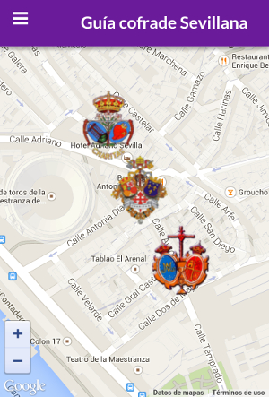
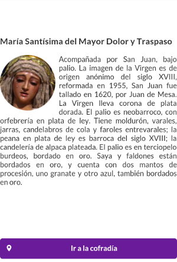
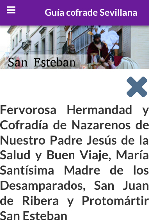
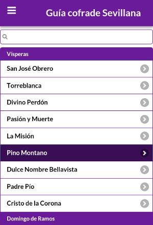

# Guia Cofrade Sevillana

Guía Cofrade para la Semana Santa de Sevilla
=======

Guía sobre la Semana Santa de Sevilla con información sobre los distintos titulares de las Hermandades y Cofradías de la ciudad. Además, podrás saber qué cofradías se encuentran cerca, buscarlas en función de su nombre y activar la navegación de la que te provea tu dispositivo móvil para ir hacia el temaplo deseado.

#Funciona utilizando:
+ jQuery
+ jQuery Mobile
+ jQuery Mobile Flat-UI Theme
+ HandlebarsJS
+ Cordova
